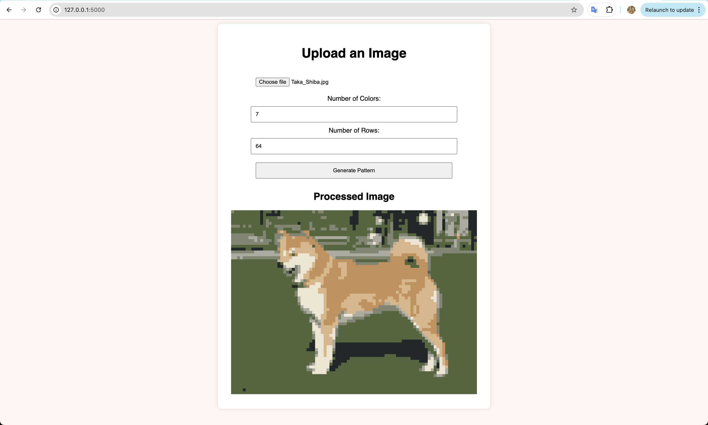

# Stitchify: turn any image into an artistic cross-stitch

- A Flask web app
- Upload an image, it is then turned into a cross stitch

## To run the flask app locally

`flask --app app run`
or
`python app.py

